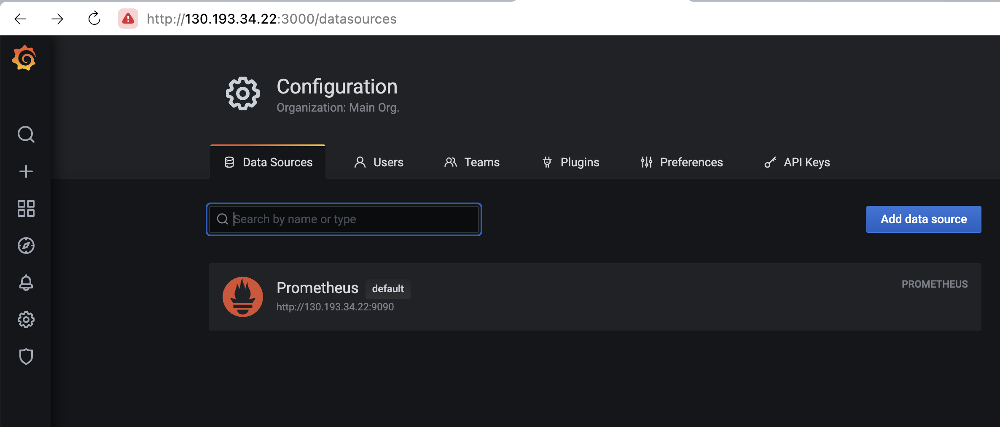
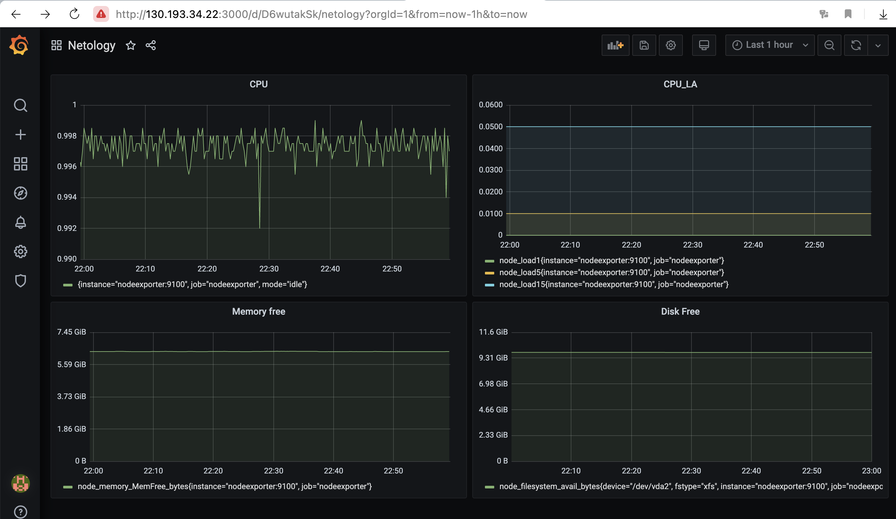
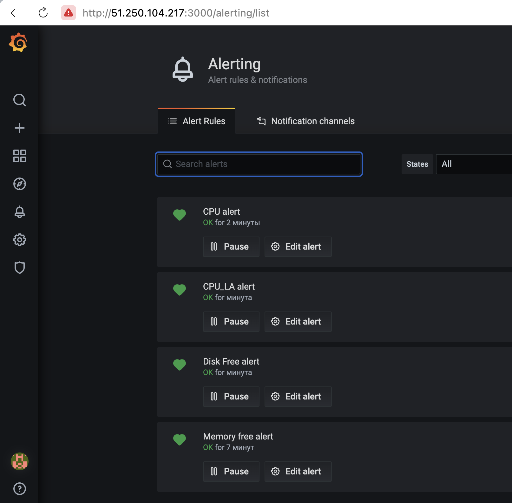
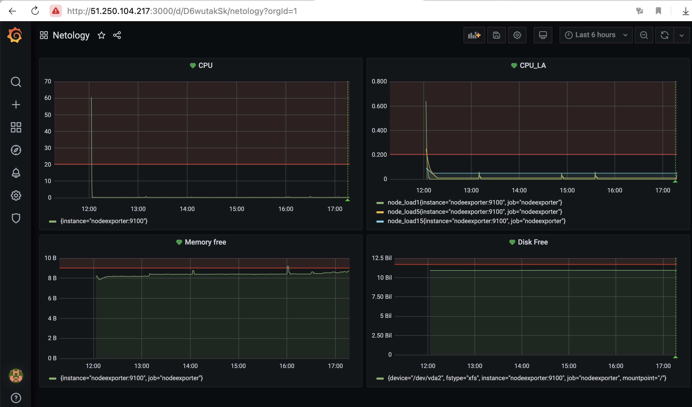

# Домашнее задание к занятию 14 «Средство визуализации Grafana»

### Задание 1

1. Используя директорию [help](./help) внутри этого домашнего задания, запустите связку prometheus-grafana.
2. Зайдите в веб-интерфейс grafana, используя авторизационные данные, указанные в манифесте docker-compose.
3. Подключите поднятый вами prometheus, как источник данных.
4. Решение домашнего задания — скриншот веб-интерфейса grafana со списком подключенных Datasource.
<p align="center">
  
</p>

## Задание 2

Создайте Dashboard и в ней создайте Panels:

- утилизация CPU для nodeexporter (в процентах, 100-idle);
```
avg without (cpu)(irate(node_cpu_seconds_total{job="nodeexporter",mode="idle"}[1m]))
```
- CPULA 1/5/15;
```
node_load1{job="nodeexporter"}
node_load5{job="nodeexporter"}
node_load15{job="nodeexporter"}
```
- количество свободной оперативной памяти;
```
node_memory_MemFree_bytes{job='nodeexporter'}
```
- количество места на файловой системе.
```
node_filesystem_avail_bytes{device="/dev/vda2", fstype="xfs", instance="nodeexporter:9100", job="nodeexporter", mountpoint="/"}
```

Для решения этого задания приведите promql-запросы для выдачи этих метрик, а также скриншот получившейся Dashboard.
<p align="center">
  
</p>

## Задание 3

1. Создайте для каждой Dashboard подходящее правило alert — можно обратиться к первой лекции в блоке «Мониторинг».
<p align="center">
  
</p>

2. В качестве решения задания приведите скриншот вашей итоговой Dashboard.
<p align="center">
  
</p>

## Задание 4

1. Сохраните ваш Dashboard. Для этого перейдите в настройки Dashboard, выберите в боковом меню «JSON MODEL». Далее скопируйте отображаемое json-содержимое в отдельный файл и сохраните его.  
2. В качестве решения задания приведите листинг этого файла.  
[Dashboard_Export.json](https://github.com/kibernetiq/netology_grafana/blob/main/Dashboard_Export.json)
